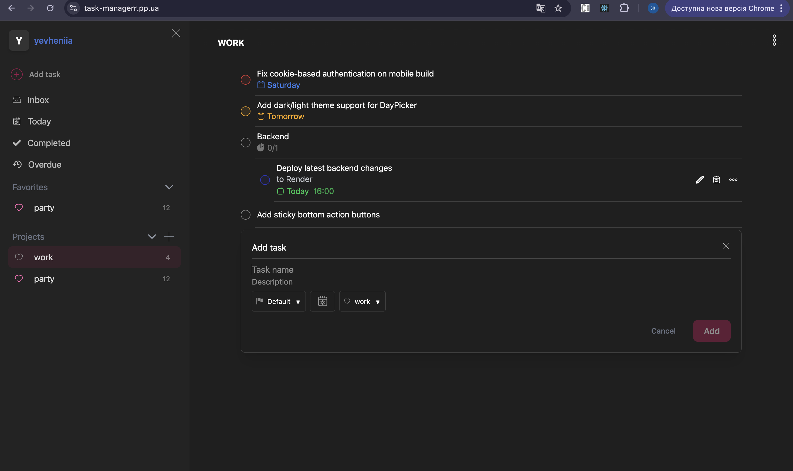
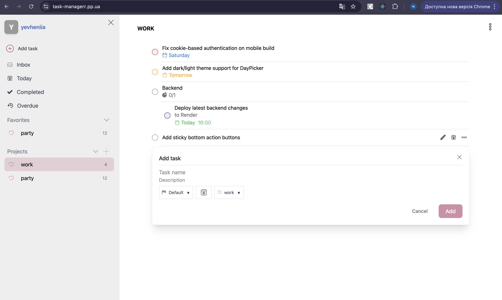
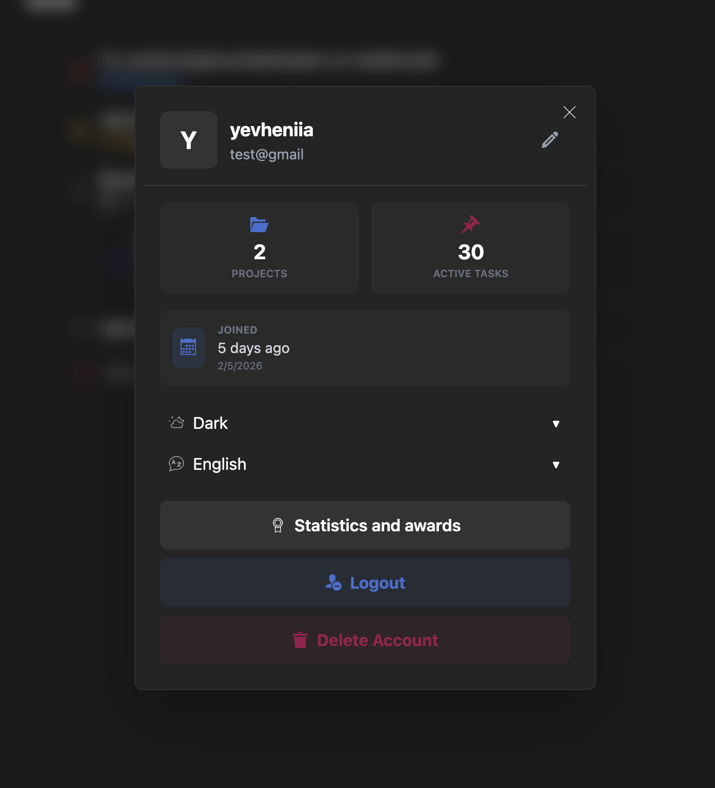
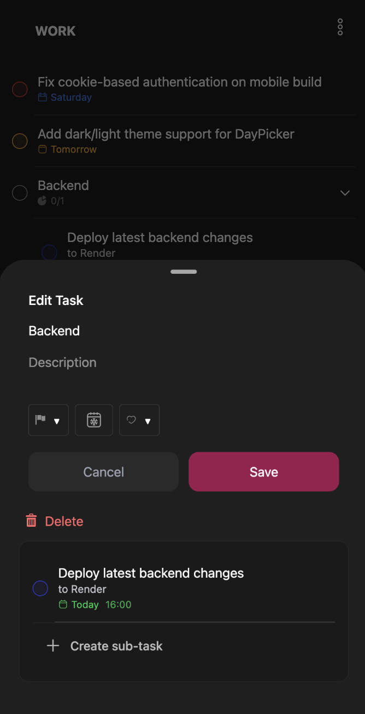
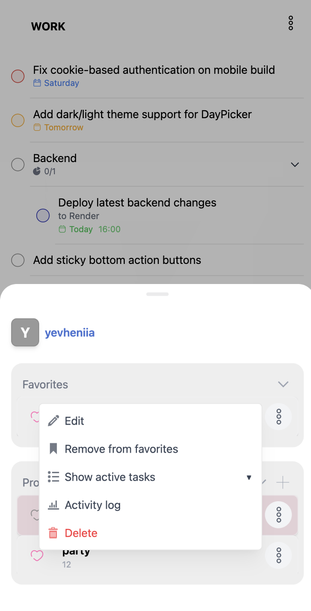
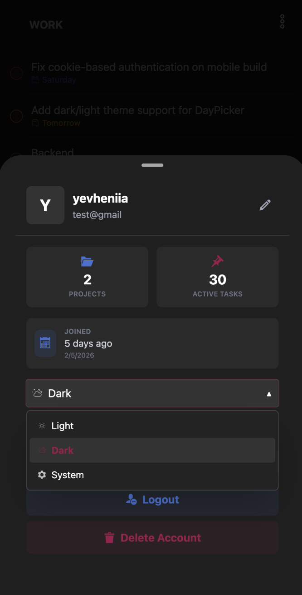

# Task Manager App

A full-stack task management app inspired by Notion, built with React, TypeScript, and Node.js.

## What it does

Organize your workflow into projects, sections, and tasks. Create subtasks, set priorities and deadlines, and track progress in a clean and modern interface. Fully responsive for both desktop and mobile.

## Features

- Authentication system (register/login)
- JWT-based auth stored in **httpOnly secure cookies**
- Projects with color labels and favorites
- Task management with subtasks
- Sections for better organization
- Priorities and due dates
- Mobile-friendly responsive UI
- Type-safe database layer with Prisma ORM

## Tech Stack

Frontend: React 18, TypeScript, Vite, TailwindCSS, Framer Motion  
Backend: Node.js, Express, TypeScript  
Database: PostgreSQL

## Screenshots








## Quick Start

Frontend:

```bash
cd client
npm install
npm run dev
```

Backend:

```bash
cd server
npm install
npx prisma db push
npm run dev
```

Frontend runs at: https://task-managerr.pp.ua
Backend runs at: https://api.task-managerr.pp.ua

Folder Structure

Frontend (/src):

/api — HTTP client and API requests
/components — UI components
/context — Global state providers
/hooks — Custom React hooks
/types — Shared TypeScript types

Backend (/src):

/controllers — Request handlers
/routes — REST API endpoints
/middleware — Cookie-based auth verification

Database:

/prisma/schema.prisma — Prisma schema and models

Status

MVP complete. Core functionality is working.
Next improvements are listed in ROADMAP.md.
